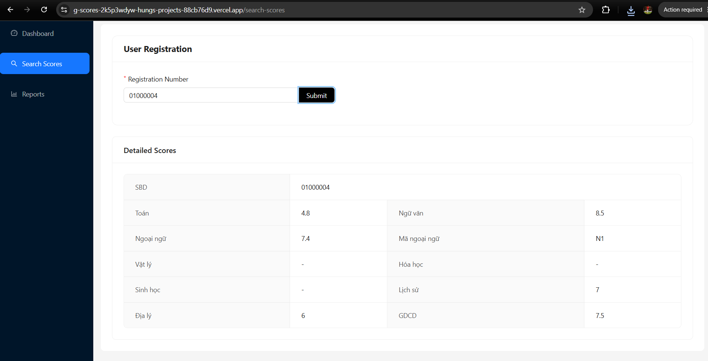
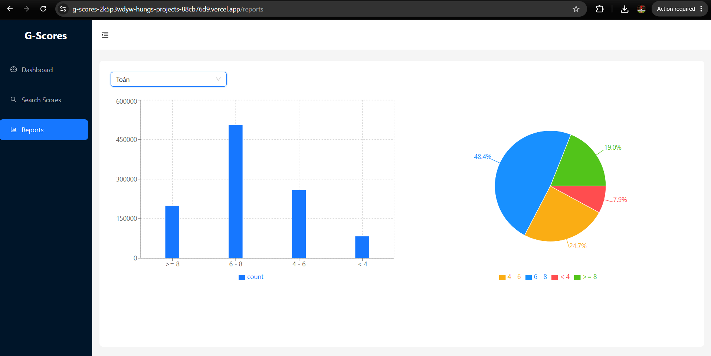
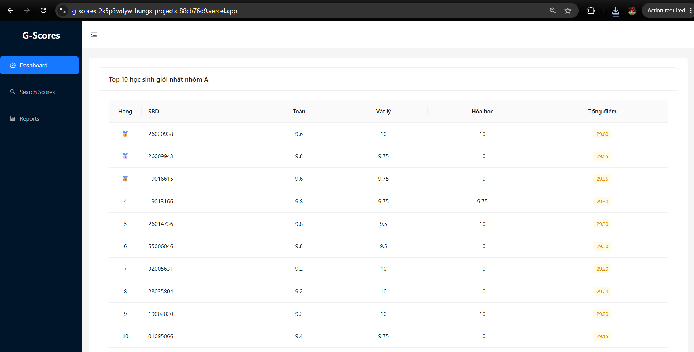

# G-Scores Frontend

## Giới thiệu

Frontend của **G-Scores** được xây dựng bằng **ReactJS**, **Ant Design** và **Recharts**, cung cấp giao diện để:

* Tra cứu điểm theo số báo danh.
* Thống kê điểm theo từng môn bằng biểu đồ.
* Hiển thị Top 10 thí sinh khối A.

## Demo

* Frontend: https://g-scores-2k5p3wdyw-hungs-projects-88cb76d9.vercel.app
* Backend API: https://g-scores-be-1l4i.onrender.com

## Công nghệ sử dụng

* ReactJS
* React Router DOM
* Ant Design
* Recharts
* SCSS

## Cấu trúc thư mục

```text
Frontend
├── public/
├── src
│   ├── layouts/        # Layout của ứng dụng
│   ├── pages/          # Các trang
│   ├── routes/         # Cấu hình Router
│   ├── services/       # Gọi API đến Backend
    ├── utils/          # Gọi API đến Backend
│   ├── App.js
│   └── index.js
├── .env
├── package.json
└── README.md
```

## Hướng dẫn chạy dự án

### 1. Clone repository

```bash
git clone https://github.com/hunghoangphi2004/g-scores-fe.git
cd g-scores-fe
```

### 2. Cài đặt thư viện

```bash
npm install
```

### 3. Chạy Backend (nếu chưa có)

Frontend cần kết nối với Backend để lấy dữ liệu.

Clone Backend:

```bash
git clone https://github.com/hunghoangphi2004/g-scores-be.git
cd g-scores-be
npm install
```

Tạo file `.env`

```env
PORT=3000

MONGO_URL=YOUR_MONGO_DATABASE_URL
```

Import dữ liệu:

```bash
npm run seed
```

Khởi động Backend:

```bash
npm run dev
```

Backend mặc định chạy tại:

```text
http://localhost:3000
```

### 4. Cấu hình biến môi trường

Tạo file `.env`

Nếu chạy Backend cục bộ:

```env
REACT_APP_API_DOMAIN=http://localhost:3000/api
```

Nếu sử dụng Backend đã triển khai:

```env
REACT_APP_API_DOMAIN=https://g-scores-be-1l4i.onrender.com/api
```

### 5. Khởi động Frontend

```bash
npm start
```

Mặc định Frontend chạy tại:

```text
http://localhost:3001
```

## Chức năng

* Tra cứu điểm theo số báo danh.

* Thống kê điểm theo từng môn bằng biểu đồ.

* Hiển thị Top 10 thí sinh khối A.

